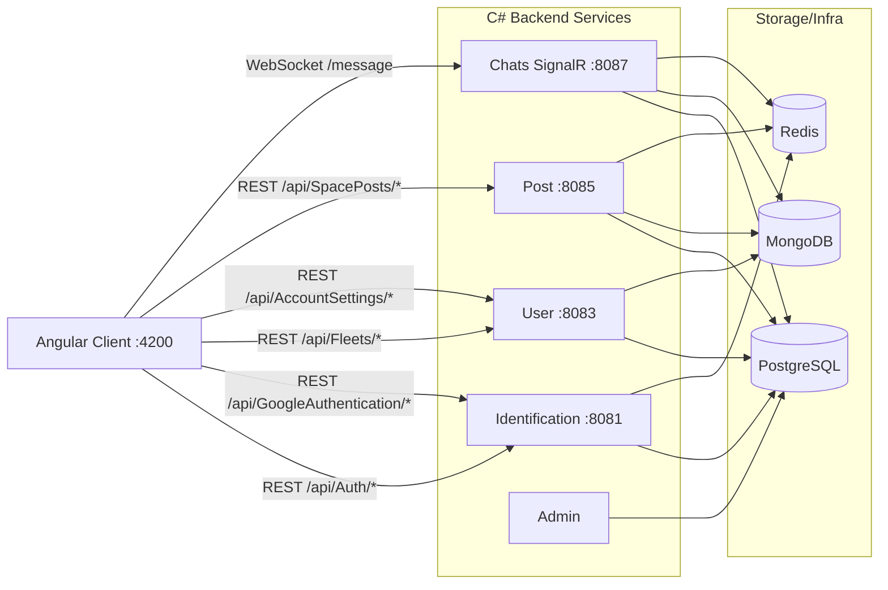

# Povidom  
Spacegram is a social network pet project that combines:  
- **Security, optimization, and speed** of Telegram, providing data privacy, end-to-end message encryption, and instant feedback from the interface.  
- Ease of publishing and interacting, similar to Twitter and Instagram: users can easily create posts, edit them, comment, repost, and interact with the community.  

---
## Figma 
https://www.figma.com/design/9AB2n1nmHDC40VpjOpRnaK/Spacegram?node-id=0-1&t=nyJxmrwRSrmDSIEz-1

---

## Architecture Monitoring (Client + Backend)

The idea is to build Povidom (Spacegram) as a social network with a split architecture: an Angular client, a set of C# services (Auth/User/Post/Chats/Admin), and mixed storage (PostgreSQL + MongoDB + Redis) to balance consistency, speed, and real-time behavior.

### Visual Architecture



### Architecture Monitoring: connected now

- Auth flow: `Client -> api/Auth/registration|login -> Identification(Auth controller)`.
- Google OAuth: `Client -> api/GoogleAuthentication/GoogleAuth -> Identification(GoogleAuthentication controller)`.
- Session check: `Client -> api/AccountSettings/SessionsUpdate -> User(AccountSettings controller)`.
- User profile/search/following: `Client -> api/Fleets/* -> User(Fleets controller)`.
- Posts feed/actions: `Client -> api/SpacePosts/* -> Post(SpacePosts controller)`.
- Realtime chat: `Client SignalR -> https://localhost:8087/message -> Chats(ChatHub)`.

### Architecture Monitoring: not connected or partially connected

- **Google endpoint contract mismatch**: frontend expects JSON `{ url }`, while backend returns `Redirect(...)`; integration works as browser redirect, not as a clean API response contract.
- **`GetMessage` flow incomplete on client**: in `MessagesComponent`, the call is made without guaranteed chat creation/selection first (`this.chat.id` can be empty before initialization).
- **SignalR origin inconsistency**: chat service allows CORS for `https://localhost:4200`, while other services are configured for `http://localhost:4200`; this can cause unstable local integration.
- **Response shape mismatches**: client often expects lower-case keys (`id`), while several controllers return other shapes (`ID`, `User`, `Users`, `Post`), which can lead to mapping/runtime issues.
- **Part of backend API is not consumed by client**: several routes (`ChangePassword`, and other service endpoints) currently have no corresponding client calls in `Client/src/app/api`.

### Current connection map (short)

- `Client REST services` use the `api/...` prefix (requires reverse proxy or gateway routing in local/dev setup).
- `SignalR` is connected directly to `https://localhost:8087/message`.
- `Session` relies on cookie credentials (`withCredentials: true`) in REST and server-side session resolution.
- Profile/session/relationship data is primarily in PostgreSQL; posts/chats are in MongoDB; online connection mapping is handled by Redis.

## Launching the project  

### Frontend: Angular  

1. Change to the `client` directory (or the corresponding directory with Angular code).  
2. Install the dependencies:
 
   ```bash
   npm install

### Backend: ASP.NET
1. Add the configuration files appsettings.json and appsettings.Development.json to the root directory of the backend project.
2. Example of the structure of appsettings.json:
3. AdminServer
   
   ```json
   {
     "Logging": {
       "LogLevel": {
         "Default": "Information",
         "Microsoft.AspNetCore": "Warning"
       }
     },
     "AllowedHosts": "*"
   }

4. AuthServer

   ```json
   {
     "Logging": {
       "LogLevel": {
         "Default": "Information",
         "Microsoft.AspNetCore": "Warning"
       }
     },
     "Npgsql": {
       "ConnectionString": ""
     },
     "Redis": {
       "ConnectionString": ""
     },
     "Mailhog": {
       "Host": "",
       "Port": ,
       "SenderName": "",
       "SenderEmail": "",
       "SenderPassword": ""
     },
     "GoogleAuth": {
       "ClientID": "",
       "ClientSecret": ""
     }
   }
5. MediaServer
   ```json
   {
     "Logging": {
       "LogLevel": {
         "Default": "Information",
         "Microsoft.AspNetCore": "Warning"
       }
     },
     "AllowedHosts": "*",
     "Kestrel": {
       "EndpointDefaults": {
         "Protocols": "Http2"
       }
     }
   }

6. MessagesServer
   ```json
   {
     "Logging": {
       "LogLevel": {
         "Default": "Information",
         "Microsoft.AspNetCore": "Warning"
       }
     },
     "Npgsql": {
       "ConnectionString": ""
     },
     "Redis": {
       "ConnectionString": ""
     },
     "MongoDB": {
       "ConnectionString": "",
       "MongoDbDatabase": "",
       "MongoDbDatabaseChat": ""
     }
   }

7. PostServer
   ```json
   {
      "Logging": {
        "LogLevel": {
          "Default": "Information",
          "Microsoft.AspNetCore": "Warning"
        }
      },
      "Npgsql": {
        "ConnectionString": ""
      },
      "Redis": {
        "ConnectionString": ""
      },
      "Mailhog": {
        "Host": "",
        "Port": ,
        "SenderName": "",
        "SenderEmail": "",
        "SenderPassword": ""
      },
      "GoogleAuth": {
        "ClientID": "",
        "ClientSecret": ""
      },
      "MongoDB": {
        "ConnectionString": "",
        "MongoDbDatabase": "",
        "MongoDbDatabaseChat": ""
      }
   }

8. UserServer
   ```json
   {
     "Logging": {
       "LogLevel": {
         "Default": "Information",
         "Microsoft.AspNetCore": "Warning"
       }
     },
     "Npgsql": {
       "ConnectionString": ""
     },
     "Redis": {
       "ConnectionString": ""
     },
     "MongoDB": {
       "ConnectionString": "",
       "MongoDbDatabase": "",
       "MongoDbDatabaseChat": ""
     }
   }


### Backend: Spring
1. Add the configuration files
```
└── src
    └── main
        └── resources
            ├── application.properties
            └── Config
                └── Postgres
                    └── hibernate.cfg.xml"
```

3. Example of the structure of application.properties:
 
   ```bash
   spring.application.name=server
   server.port=8090
4. Example of the structure of hibernate.cfg.xml:
 
   ```bash
   <hibernate-configuration>
       <session-factory>
           <property name="hibernate.connection.driver_class">org.postgresql.Driver</property>
           <property name="hibernate.connection.url"></property>
           <property name="hibernate.connection.username"></property>
           <property name="hibernate.connection.password"></property>
           <property name="hibernate.dialect">org.hibernate.dialect.PostgreSQLDialect</property>
   
           <property name="hibernate.archive.autodetection">class</property>
       </session-factory>
   </hibernate-configuration>

### HTPS: Grpc
1. you have to create KEY; CSR CRT; PFX; PEM
2.  Creating a private key (private.key)
    ```bash
     openssl genpkey -algorithm RSA -out private.key -aes256

3.  Creating a request certificate (CSR) - request.csr
      ```bash
     openssl req -new -key private.key -out request.csr

4.  Create a self-signed certificate (certificate.crt)
    ```bash
     openssl x509 -req -in request.csr -signkey private.key -out certificate.crt

5.  Converting a certificate to PEM format (certificate.pem)
    ```bash
     openssl x509 -in certificate.crt -out certificate.pem
    
8.  Converting a private key to PEM (private.pem)
    ```bash
     openssl rsa -in private.key -out private.pem
    
8.  Create a PFX file (PKCS#12)
    ```bash
    openssl pkcs12 -export -out keystore.pfx -inkey private.key -in certificate.crt -certfile certificate.crt -passout pass:yourpassword

